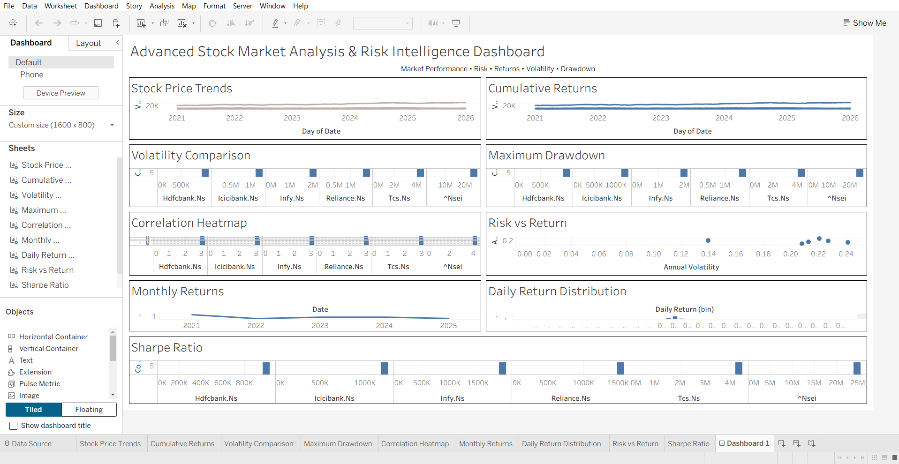

# Advanced Stock Market Analytics & Risk Intelligence Dashboard

## Project Overview

This project analyzes the performance and risk of major Indian stocks using Python and Tableau.

The analysis covers stock returns, volatility, cumulative returns, maximum drawdown, correlation, risk vs return, monthly returns, daily return distribution, moving averages, and Sharpe ratio.

## Stocks Analyzed

- Reliance Industries
- TCS
- Infosys
- HDFC Bank
- ICICI Bank
- NIFTY 50

## Technologies Used

- Python
- Pandas
- NumPy
- Matplotlib
- Seaborn
- yFinance
- Jupyter Notebook
- Tableau Public

## Key Analyses

- Stock Price Trends
- Daily, Weekly and Monthly Returns
- Moving Averages
- Annual Volatility
- Cumulative Returns
- Maximum Drawdown
- Correlation Analysis
- Risk vs Return
- Sharpe Ratio
- Daily Return Distribution
- NIFTY 50 Benchmark Comparison

## Project Structure

```text
Stock-Market-Analysis/
├── dashboard/
│   ├── Advanced_Stock_Market_Analytics.twb
│   └── Advanced_Stock_Market_Analytics.twbx
├── data/
│   ├── raw/
│   └── processed/
├── notebooks/
│   └── 01_data_collection.ipynb
├── images/
├── src/
├── README.md
└── requirements.txt
- Daily Return Distribution
- NIFTY 50 Benchmark Comparison

## Project Structure

```text
Stock-Market-Analysis/
├── dashboard/
│   ├── Advanced_Stock_Market_Analytics.twb
│   └── Advanced_Stock_Market_Analytics.twbx
├── data/
│   ├── raw/
│   └── processed/
├── notebooks/
│   └── 01_data_collection.ipynb
├── images/
├── src/
├── README.md
└── requirements.txt

## Dashboard Preview

- Daily Return Distribution
- NIFTY 50 Benchmark Comparison

